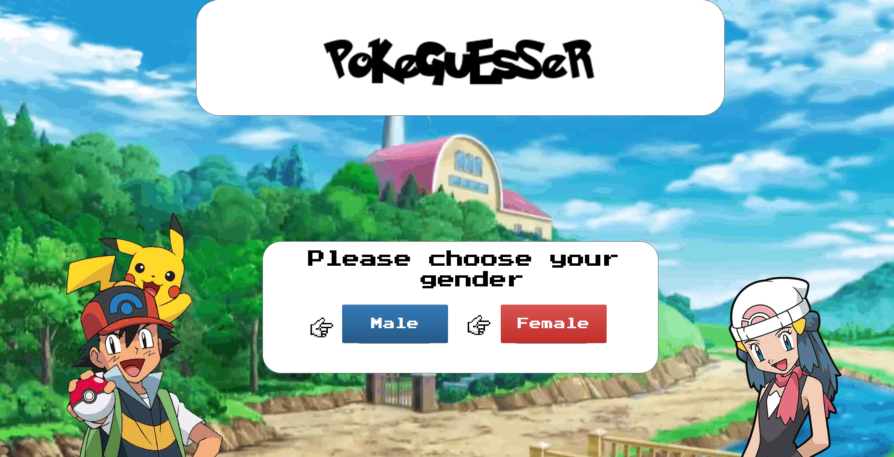
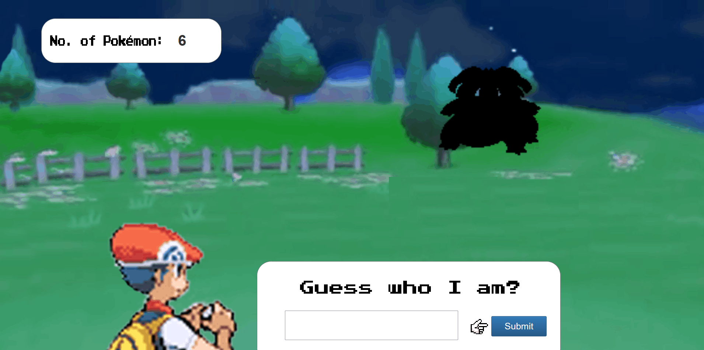
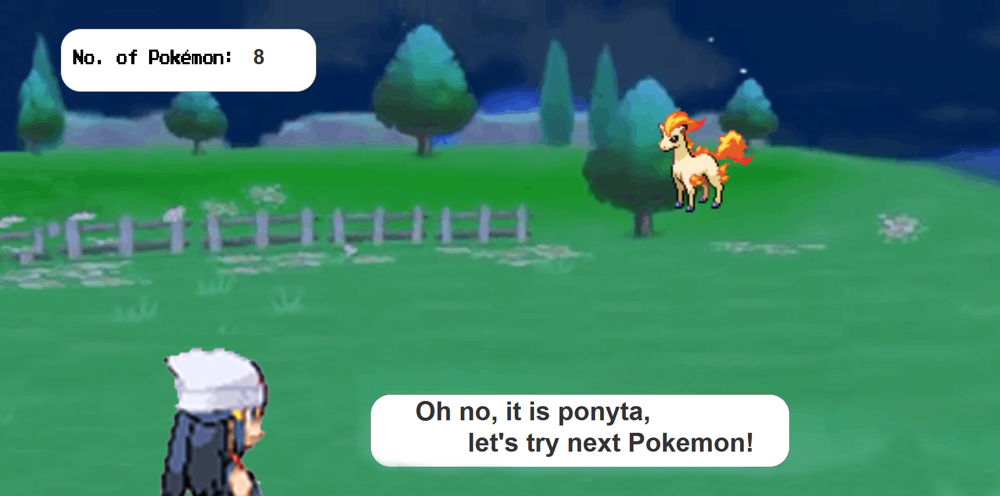

# PokeGuesser
Frontend Developer: Kelsie Chye
Frontend Developer & Backend Developer: Ong Jia Yuan

This is a site mostly for Pokémon enthusiasts or fans to test their Pokémon knowledge. Silhouettes of random Pokémon will be tossed at the user, with each accurate guess increasing the player's score.

It is created in such a way that the user feels as though they are in a Pokémon battle where they must guess the unknown Pokémon they are battling. It is an interactive design that also allows users to choose their username and gender, which customizes the Pokémon trainer with whom they are battling. 

## Design Process
 
This website application's goal is to build something that Pokémon enthusiasts would like. 

As fellow Pokémon fans, we chose to go with a design that would allow you to enjoy our guessing game with a layout similar to the Pokémon battles of older generation Pokémon franchise. We intended to provide a customizable playing experience because most of us gamers appreciate being able to customize our characters, which is why we included the ability to choose the gender of the Pokémon trainers.

We began with a simple welcome screen that requests your username. This is the point at which Professor Oak asks you for your name, signaling the start of your Pokémon adventure. Following that, they will ask you for your gender, which will also determine which Pokémon trainer you will use in the game. It would then take you to a loading screen before transitioning to the main guessing game.

## Features

In the beginning, users can enter their unique user names to verify identities then get their Pokémon teams. If they don't have existing user names yet, this step will assist them in creating ones.

There will be a gender selection screen after user input their desired user names which will then affect the gender of your Pokémon trainer during the battle! 

Loading screen will be shown before a wild Pokémon shows out with shadow! Guess the name and submit it! The system will provide feedback about the answer.
 
### Existing Features

- Username input: Asks users for their username allowing for their score to be recorded under their username

- Gender selection: By selecting your gender here, it affects which Pokémon trainer you will be using later in the game

- Loading screen: An animated loading screen for the users to see while the actual game is still loading

- PokéGuesser: The PokéGuesser game where the user has to guess what the mystery Pokémon is and for every correct answer, they earn a point.

### Features Left to Implement

- Battle music will be played during guessing scene (In-development)
- Sound will be played when cursor hover to each of the buttons
- Saving score uniquely for each username

## Technologies Used

- [JQuery](https://jquery.com)
    - The project uses **JQuery** to ease the usage of Javascript and wrap them into a method which can be called from a single line of code.

- [PokéAPI](https://pokeapi.co/)
    - The project uses **PokéAPI** to fetch the data which contains everything about Pokémon.

- [Bootstraps](https://www.bootstrapcdn.com/)
    - The project uses **Bootstraps** to easily create a responsive effects.

- [Popper](https://popper.js.org/)
    - The project uses **Popper** to calculate the positioning of an element.

## Testing

1. Battle page:
    1. Try to submit pokemon names with jumbled letters such as capital and non capitalized letters and verify that the pokemon name will appear as correct

    2. Try to reload the website and check the scores, verify that the score has appeared to be reset

    3. Try to continue battle after each guesses by clicking anywhere on the screen or clicking on the system feedback box and verify that it will direct user back to the battle scene page

### Bugs/Problems encountered

1. Username page:
   1. User can leave blanks in the user input box and still be able to proceed. (Could be a feature incase user might not want to leave their user name in)
   
2. Gender page:
   1. Issue faced in the Gender page not able to redirect the pages to proceed after user select their desired gender for their Pokémon trainer.

3. Loading page:
   1. Image animation not spinning during loading page screen.

4. Battle page:
   1. Pokémon trainer does not appear at the bottom left of the screen.

   2. Pokémon trainer does not appear at the correct position after user press submit after guessing the name of the Pokémon.

   3. Scores(No. of Pokemon) not incrementing during each correct guesses.

   4. System does not feedback whether user guessed correctly or wrongly.

   5. System does not redirect user back to battle page after each guesses.

## Credits
### Media

- The photos used in this site were obtained from:
- [Professor Oak](https://toppng.com/being-charismatic-and-popular-professor-oak-often-okido-pokemo-PNG-free-PNG-Images_217605)
  - Picture used for the user name page
- [Professor Oak's House](https://bulbapedia.bulbagarden.net/wiki/Professor_Oak%27s_Laboratory)
  - Picture used for the background of the user name page
- [PokéBall](https://tenor.com/view/pokeball-spin-pokeball-pokemon-gif-15432842)
  - Picture used for the lottie loading animation page
- [Pokémon Trainer Sprites](https://www.pinterest.jp/pin/371969250456970130/?amp_client_id=CLIENT_ID(_)&mweb_unauth_id=&simplified=true)
  - Picture used to identify Pokémon trainer male and female

### Acknowledgements

- I received inspiration for this project from original Pokémon show during the commercial bumpers with a mixed element of Pokémon battle scene.
